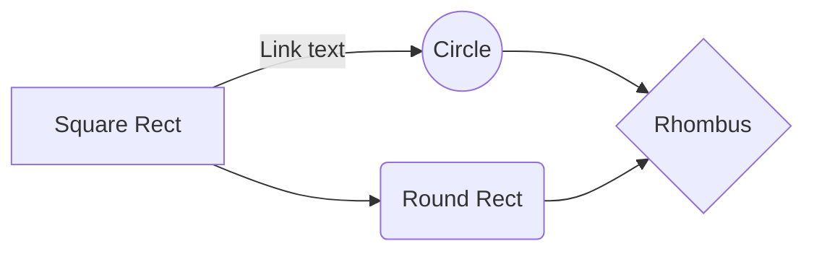

# Limbaje formale si tehnici de compilare

## Language specifications
1. #### Language definition
    1. *Upper* (A-Z) and *lower* (a-z) case letters of the english alphabet
    2. *Underline* (_)
    3. *Decimal* digits (0-9)
2. #### Lexical rules
    1. ###### Special symbols 
        1. operators: `-`, `+`, `/`, `*`, `%`, `:=`, `<`, `<=`, `==`, `>=`, `>`
        2. separators: `{`, `}`, `[`, `]`, `;`, `:`
        3. reserved keywords: 
            * `number`
            * `string`
            * `array`
            * `dictionary`
            * `program`
            * `if`, `else`, `elseif`
            * `for`, `while`
    2. ###### Identifiers
        * a sequence of letters and  digits, such that the first charater is a letter; the rule is: 
            * `identifier ::= letter | letter{letter}{digit}`
	        * `letter ::= 'a' | 'b' | ... | 'z' | 'A' | ... | 'Z'`
	        * `digit ::= '0' | '1' | ... | '9'`
    3. ###### Constants
        1. Integer - rule
            * `noconst := +no | -no | no`
	        * `no := digit{no}`
	    2. character
	        * `character := 'letter' | 'digit'`
	    3. string
	        * `constchar := 'string'`
	        * `string := char{string}`
	        * `char := letter | digit`
	4. ###### Data types:
	    1. `number` - a decimal number, can be integer and also float
	    2. `string` - a string o characters
	    3. `array` - an array of objects
	    4. `dictionary` - a dictionary mapping an object to another object
	    
